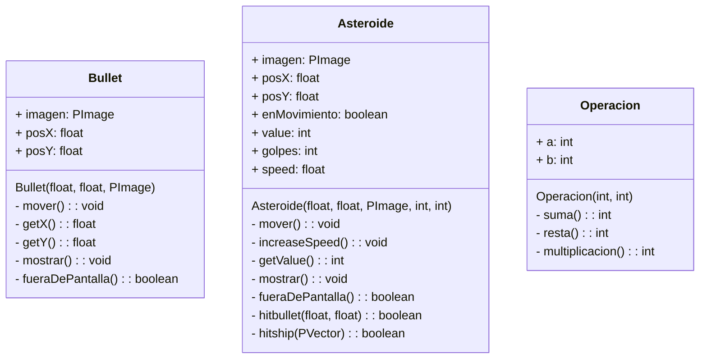

## SPACE MATH 🚀☄️🔢

**Descripción:**

Un juego desafiante donde controlas una nave espacial para destruir asteroides con operaciones matemáticas.

**Características:**

* Sensor ultrasónico para controlar la nave.
* Micrófono para activar las balas.
* Diferentes niveles de dificultad.
* Sistema de puntuación.

**Requisitos:**

* Arduino UNO R3
* Sensor ultrasónico HY-SRF05.
* Micrófono.

**Instrucciones:**

1. Conecte el sensor ultrasónico y el micrófono al Computador.
2. Ejecute el programa del juego.
3. Mueva su mano para controlar la nave.
4. Presionar el gatillo en el micrófono para disparar.
5. Destruya asteroides con la respuesta correcta.
6. Evite que los asteroides destruyan la nave.

**Niveles de dificultad:**

* Fácil: Velocidad de asteroides lenta y operaciones matemáticas simples.
* Medio: Velocidad de asteroides moderada y operaciones matemáticas más complejas.
* Difícil: Velocidad de asteroides rápida y operaciones matemáticas desafiantes.

**Puntuación:**

* Gana puntos por cada asteroide destruido con la respuesta correcta.
* La puntuación final se muestra al finalizar el juego.

**Desafío:**

¡Destruye la mayor cantidad de asteroides posible y alcanza la puntuación más alta!

# Ventajas
* **Herramienta educativa:** Es una herramienta valiosa para que los padres y educadores puedan enseñar matemáticas a los niños de una manera divertida y atractiva.
* **Aprendizaje personalizado:** El juego se adapta al ritmo de aprendizaje de cada niño, aumentando gradualmente la dificultad de las operaciones matemáticas.
* **Motivación y autoestima:** Los niños se sentirán motivados para aprender y mejorar sus habilidades matemáticas, aumentando su autoestima y confianza a la hora de enfrentarse a retos bajo presión.

## Programacion Orientada a Objetos

La implementación de la POO nos permite modificar libremente las caracteristicas de cada uno de los componentes del juego, con ello podemos aumentar dificultades, aumentar tiempo, aumentar el tamaño de las balas, agregar nuevas operaciones
matematicas, entre otros. Se es implementada en SpaceMath para que se ajusta a las necesidades de cada usuario y a su método de enseñanza.

# Componentes de hardware:

- **Arduino UNO R3**: La placa microcontroladora central que procesa las señales del sensor ultrasónico y el micrófono, y controla el juego.
- **Sensor ultrasónico HC-SR04**: Detecta la distancia de la mano del jugador para controlar la posición horizontal de la nave espacial.
- **Micrófono de auriculares**: Capta el sonido de soplido del jugador para activar el disparo de las balas de la nave.

# Integración de software y hardware:

- **Conexión del sensor ultrasónico**: El sensor HC-SR04 se conecta al Arduino UNO R3 utilizando pines específicos para la comunicación digital.
- **Conexión del micrófono**: El micrófono de los auriculares se conecta al Arduino UNO R3 utilizando un amplificador de audio para aumentar la señal.
- **Lectura de datos del sensor**: El Arduino lee la distancia desde el sensor ultrasónico y el nivel de sonido del micrófono.
- **Control del juego**: Los datos del sensor y el micrófono se procesan en el código del juego para controlar la posición de la nave espacial y activar el disparo de las balas.

# Beneficios de la integración:

- **Experiencia de juego más inmersiva**: Los jugadores interactúan con el juego de manera física, moviendo su mano y soplando para controlar la nave espacial y disparar.
- **Aprendizaje práctico**: La interacción con el hardware refuerza los conceptos matemáticos y la coordinación mano-ojo de forma divertida y práctica.
- **Accesibilidad**: Los componentes electrónicos utilizados son económicos y fáciles de conseguir, lo que permite que más personas puedan disfrutar de la experiencia SpaceMath.
  

## Screenshots
https://github.com/sicei/SpaceMath/assets/113460982/a70a57b6-ec24-4f17-af32-3a5ec9d43692

    
    
    

